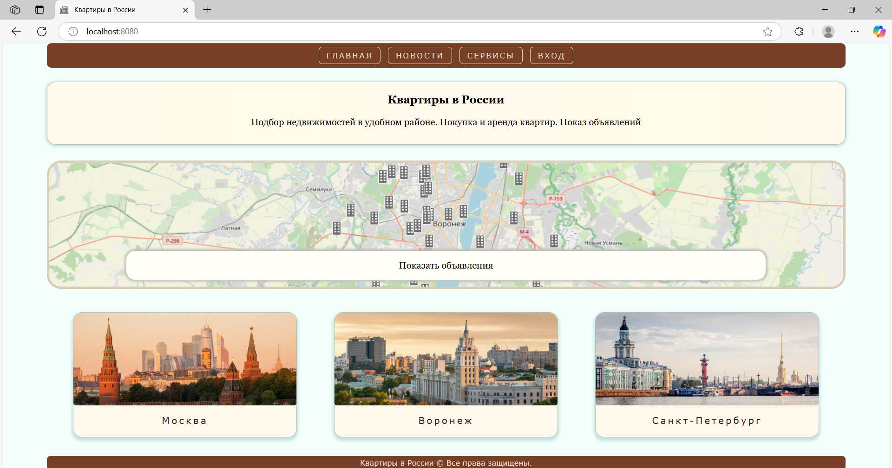
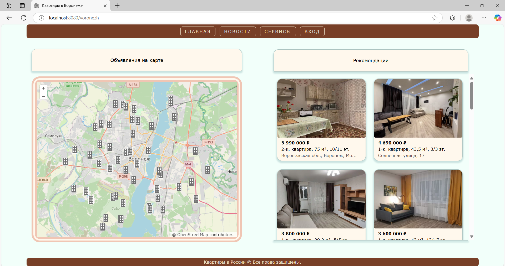
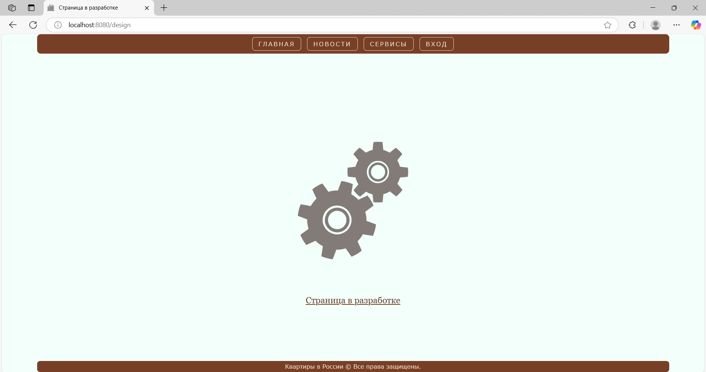
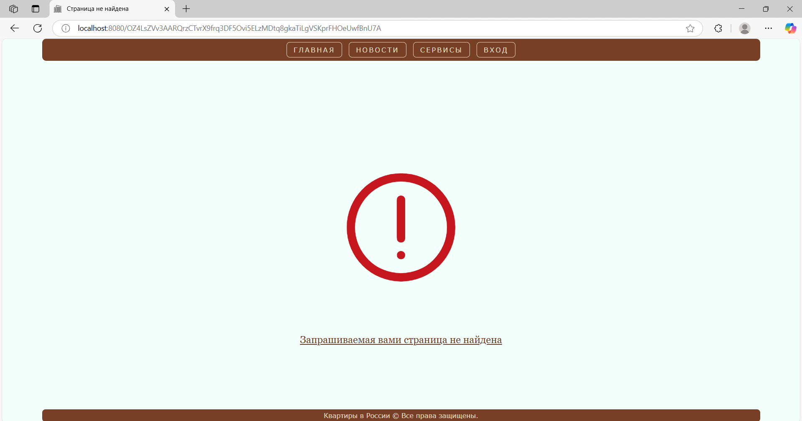
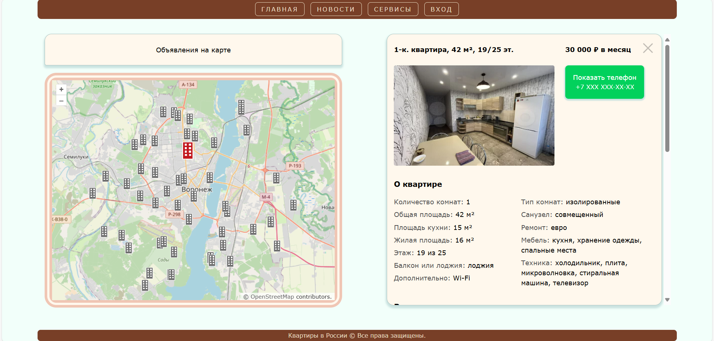
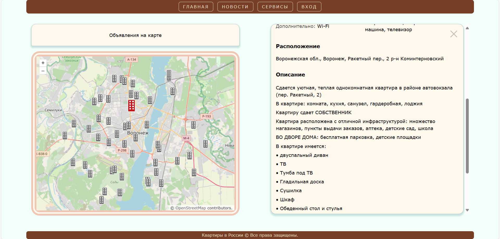
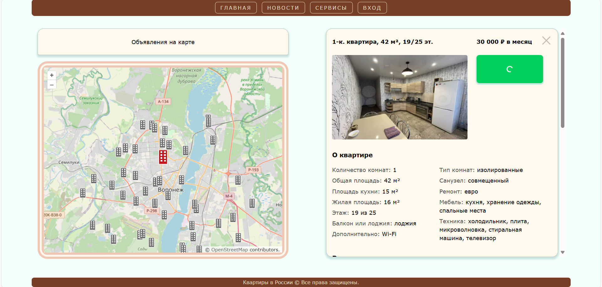
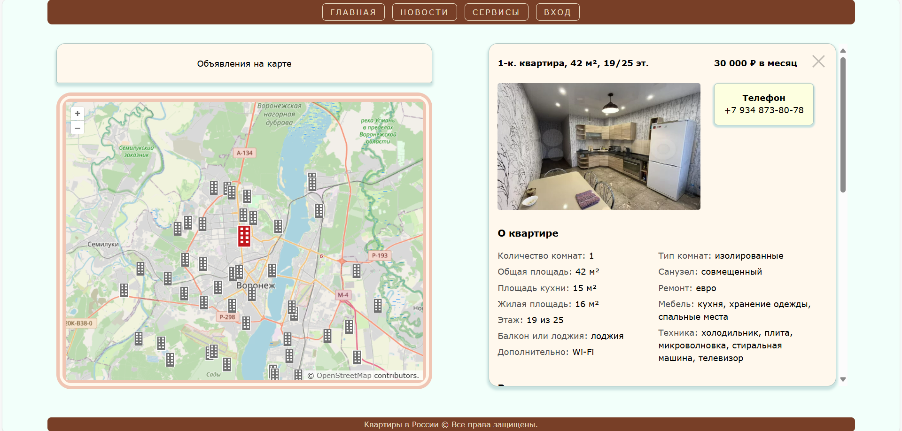
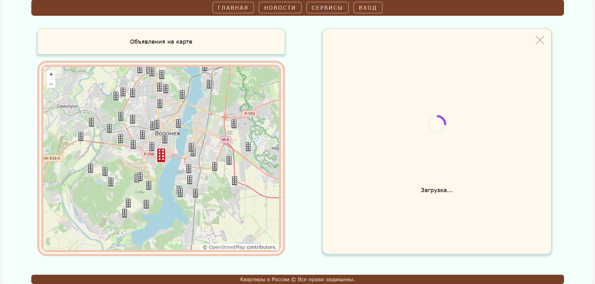

## Квартиры в России
Квартиры в России - веб приложение для поиска недвижимости в удобном районе.

## Стек
**Frontent**: JavaScript, React, Openlayers, HTML, CSS  
  
**Backend**: Java, Spring Boot, Spring MVC, Spring JPA  
  
**SQL**: h2 database  
  
## Запуск
#### Сборка:  
- mvn clean package  
- mvn spring-boot:run  

#### Главная страница: 
http://localhost:8080/  
  
  

#### Воронеж:
http://localhost:8080/voronezh  
  
  
  

#### Страница в разработке:
http://localhost:8080/design  
  
  

#### Страница не найдена:
http://localhost:8080/OZ4LsZW3AARQrzCTvrX9frq3DF5Ovi5ELzMDtq8qkaTiLqVSKprFHOeUwfBnU7A  

 
  

#### Информация о квартире  
  

####

#### Загрузка телефона

#### Телефон

#### Длительная загрузка квартиры

#### Описание:
- При клике на маркер он выделяется,  открывается информация о квартире
- При закрытии открывается показ объявлений